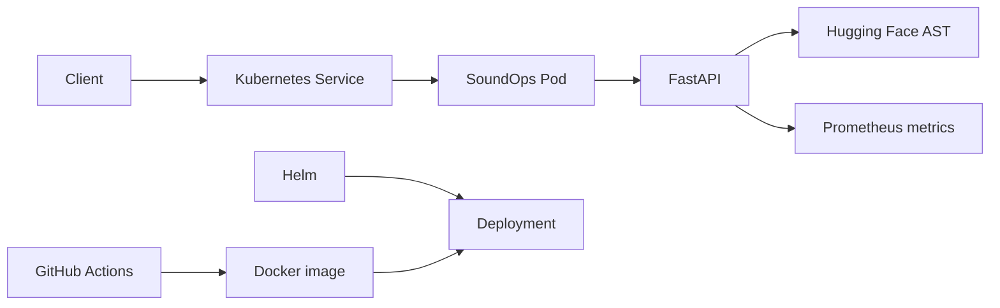

# SoundOps

A small, interview-ready audio classification service that connects AI model
serving with practical DevOps work:

- FastAPI upload and inference API
- Hugging Face Audio Spectrogram Transformer
- Dockerized Linux runtime
- Helm deployment to Minikube/Kubernetes
- Startup, readiness, and liveness probes
- Resource requests, limits, ResourceQuota, and LimitRange
- Namespace-scoped ingress NetworkPolicy
- Prometheus-compatible metrics
- GitHub Actions for linting, tests, and container builds
- Non-root, least-privilege container settings

SoundOps was built to reinforce the Linux Foundation *Introduction to
Kubernetes* material with a real model-serving workload. It is intentionally a
local learning project and does not claim to be equivalent to operating AKS or
EKS in production.

## Architecture



## What the API exposes

| Endpoint | Purpose |
|---|---|
| `GET /` | Browser demo |
| `POST /predict` | Upload audio and return top labels |
| `GET /healthz` | Process liveness |
| `GET /readyz` | Model readiness |
| `GET /metrics` | Prometheus metrics |
| `GET /docs` | OpenAPI/Swagger documentation |

## Prerequisites on Windows

Confirm these commands work:

```powershell
docker version
minikube version
helm version
```

Install Helm when needed from the official Helm installation instructions.
Docker Desktop should be running in Linux-container mode.

## Fastest Minikube deployment

From the repository root:

```powershell
.\scripts\deploy.ps1
```

The first build and first pod start are slow because PyTorch is installed in
the image and the model is downloaded into the pod's Hugging Face cache.

Watch startup:

```powershell
.\scripts\logs.ps1
```

When the pod is ready, open a second PowerShell window:

```powershell
.\scripts\port-forward.ps1
```

Visit:

```text
http://127.0.0.1:8000
```

Keep the port-forward PowerShell window open.

## Manual deployment commands

```powershell
minikube start --driver=docker --cpus=4 --memory=6144

docker build -t soundops:0.1.0 .
minikube image load soundops:0.1.0

helm upgrade --install soundops .\helm\soundops `
  --namespace soundops `
  --create-namespace `
  --wait `
  --timeout 15m

minikube kubectl -- get pods -n soundops -w
```

Then:

```powershell
minikube kubectl -- port-forward `
  -n soundops `
  service/soundops-soundops 8000:80
```

## Test an upload from PowerShell

Generate a WAV file:

```powershell
python .\samples\generate_tone.py
```

In a separate PowerShell window while port forwarding:

```powershell
curl.exe -X POST `
  -F "file=@samples/demo-tone.wav" `
  http://127.0.0.1:8000/predict
```

A real recording of music, speech, traffic, applause, machinery, or an animal
will produce more interesting labels than the generated tone.

## Run unit tests without downloading the model

```powershell
py -3.12 -m venv .venv
.\.venv\Scripts\Activate.ps1
python -m pip install -r requirements-dev.txt
ruff check .
pytest
```

Tests inject a fake classifier, so CI does not download model weights.

## Useful operational commands

```powershell
.\scripts\status.ps1
.\scripts\logs.ps1

minikube kubectl -- describe pod -n soundops -l app.kubernetes.io/name=soundops
minikube kubectl -- get events -n soundops --sort-by=.metadata.creationTimestamp
helm test soundops -n soundops
helm history soundops -n soundops
```

Scale the Deployment:

```powershell
minikube kubectl -- scale deployment soundops-soundops `
  -n soundops `
  --replicas=2
```

Perform a Helm update and rollback:

```powershell
helm upgrade soundops .\helm\soundops -n soundops --set replicaCount=2
helm history soundops -n soundops
helm rollback soundops 1 -n soundops
```

Stop without deleting the work:

```powershell
minikube stop
```

Remove the Helm release:

```powershell
.\scripts\teardown.ps1
```

## Metrics

SoundOps exposes:

- `soundops_predictions_total{status=...}`
- `soundops_inference_seconds`
- `soundops_upload_bytes`
- `soundops_model_ready`
- `soundops_build_info`

The pod includes Prometheus scrape annotations. A production environment could
connect these metrics to Prometheus and Grafana and add alerts for readiness
failures, elevated error rates, and high inference latency.

## How it maps to a DevOps role

| Role area | SoundOps evidence |
|---|---|
| Linux | Slim Linux image, non-root user, filesystem and process controls |
| Automation | One-command PowerShell deployment and repeatable Helm release |
| CI/CD | GitHub Actions lint, test, and image build |
| Kubernetes | Deployment, ReplicaSet, pod, Service, probes, scaling |
| Helm | Parameterized image, model, resources, probes, and policies |
| Multi-tenancy | Dedicated namespace, quota, defaults, and ingress policy |
| Observability | Structured logs, readiness endpoints, Prometheus metrics |
| Security | Least privilege, seccomp, no token mount, upload validation |
| Troubleshooting | Logs, describe, events, rollout, and Helm history commands |

## Important trade-offs

The model cache uses `emptyDir`, so a newly scheduled pod downloads the model
again. That is acceptable for a local demo but increases cold-start time. A
production design would use a pinned model artifact baked into the image, a
persistent cache, or an internal model registry.

The NetworkPolicy limits ingress to pods in the same namespace and optionally
the `monitoring` namespace. Egress remains open because the pod downloads the
model from Hugging Face during startup.

See [`docs/architecture.md`](docs/architecture.md) for additional trade-offs
and [`docs/interview-demo.md`](docs/interview-demo.md) for a three-minute demo.
